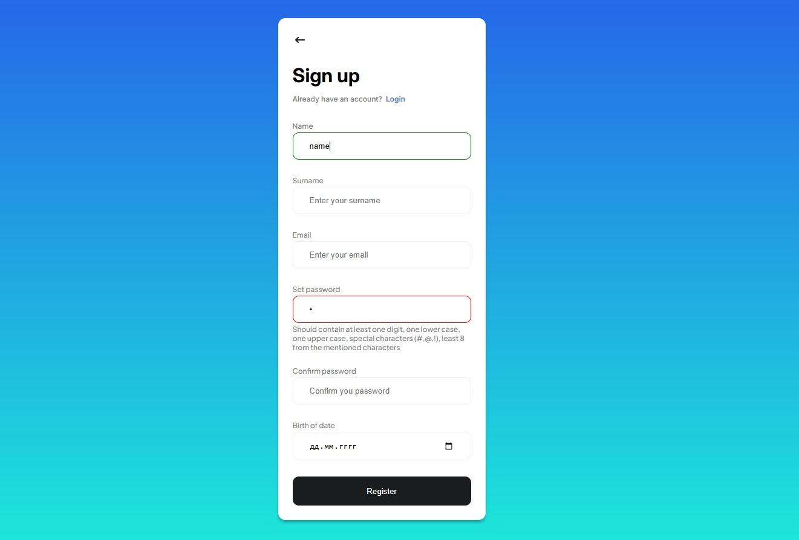

# sing-up form
Тестовое задание для 23devs.

Ссылка на работу - [Sing up form](https://mariasuz.github.io/sing-up/)
Ссылка на макет - [Figma](https://www.figma.com/design/B34HAXaZi98a2qEZtMyDj3/20-Screen-Login-%26-Register-Mobile-App-(Community)?node-id=0-1&node-type=canvas&t=RIOAlrCxUMTUXTf8-0)

Разрешение для мобильных устройств <375px.

## Тестовое задание
### 1. Реализовать html-страницу с формой регистрации. Список полей формы:
- Имя;
- Фамилия;
- Email;
- Пароль;
- Подтверждение пароля;
- Дата рождения.
Так же должна присутствовать кнопка "Отправить". Ко всем полям должны быть
соответствующие заголовки. Требований по расположению формы, заголовков и полей
ввода нет.
### 2. Реализовать валидацию полей формы средствами Javascript. Требования к валидации
полей формы:
- Поля Имя и Фамилия содержат только допустимые символы для имени и фамилии
и должны иметь адекватное ограничение по длине. Адекватность длины придется
обосновывать.
- Поле Электронный адрес должно содержать только валидный email-адрес.
- Значения полей Пароль и Подтверждение пароля должны совпадать.
- Минимальная длина пароля 8 символов. Пароль должен содержать минимум одну
цифру, по одной заглавной и строчную буквы и один символ.
- Возраст пользователя на момент регистрации в форме должен быть не младше 18
лет.
- Валидация данных должна происходить после ввода данных пользователем.
Кнопка "Отправить" должна быть заблокирована свойством "disabled", пока
пользователь не введёт валидные значения.
- Пользователь должен иметь возможность понять ошибку(и) и исправить их с
минимальным количеством попыток.
### Требования к реализации:
 1. В качестве дизайна необходимо использовать один из макетов в [фигме](https://www.figma.com/community/file/1370757927948360864/20-screen-login-register-mobile-app). Верстка
должна максимально соответствовать макету и требованиям ТЗ (иметь все необходимые
поля) и быть адаптивной.
2. Использование любых JS-фреймворков категорически неприемлемо.
3. Использование любых примеров, найденных в интернете, которые реализуют ту или иную
часть задания, категорически неприемлемо.
4. Код должен запуститься в браузерах Firefox, Chrome и Edge последних версий.
5. Типы элементов формы должны соответствовать вводимым значениям.
6. HTML-код страницы должен проходить валидацию через https://validator.w3.org/ Все
предупреждения, ошибки и предложения по оптимизации кода, которые выдает
валидатор, должны быть устранены (в случае предложений по оптимизации - должны
быть учтены).
7. Каждый элемент формы должен иметь атрибут id, включая сообщения,
используемые для валидации.
8. Придерживаемся следующих наименований для инпутов:
- id="first-name"
- id="last-name"
- id="email"
- id="password"
- id="password-confirm"
- id="birth-day"
- id="form-button"
9. По результатам валидации, теги form и все элементы формы ( теги input \ textarea \ etc )
дополняются классом "invalid" в случае невалидности формы \ элемента формы и "valid" в
случае валидности.
10. Сразу после валидного заполнения формы кнопка отправки должна быть
разблокирована, т.е. не требуется делать клик вне формы для разблокировки кнопки.
